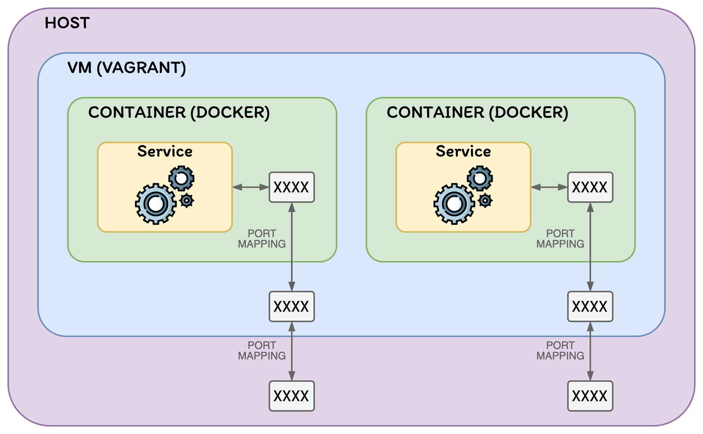

# Vagrant Docker Training

> __⭐️ Local, automated and isolated environment for learning Docker.__

This project creates a VM using [Vagrant](https://www.vagrantup.com/), that has [Docker](https://www.docker.com/)
and [Docker Compose](https://docs.docker.com/compose/) installed.

> With this, __you don't need to install Docker and Docker Compose__ on your local computer.  
> __You just need to install Vagrant and VirtualBox__.
>
> All the images and containers are created in an __isolated environment__ that can be deleted at any time.

## Architecture

Vagrant creates an Ubuntu VM that installs Docker, pulls Docker images from [DockerHub](https://hub.docker.com/),
and runs containers with their corresponding port mappings.

The automation process is specified using the following files:
1. `Vagrantfile`: Tells Vagrant how to create and configure the VM
2. `docker-compose.yml`: Tells Docker Compose which and how containers should be executed

The following diagram shows the architecture:



## Prerequisites

* [Install VirtualBox](https://www.virtualbox.org/wiki/Downloads)
* [Install Vagrant](https://www.vagrantup.com/docs/installation)

### Verify installation

> __ℹ️ Note:__
>
> Execute these steps only if it's the first time that you use Vagrant with VirtualBox.  
> If not, you can skip them. They only serve to test the Vagrant + VirtualBox installation.  
> If Vagrant and VirtualBox are installed and configured correctly,
> then the environment will work fine (it has already been tested, and is repeatable).

Check that the `vagrant` executable was added correctly to the `PATH` variable:
```bash
vagrant version
```

Check that vagrant is able to create a VM:
```bash
mkdir test-vagrant
cd test-vagrant
vagrant init ubuntu/jammy64
vagrant up
vagrant ssh
pwd
exit
vagrant destroy --force
cd ..
rm -rf test-vagrant
```

> ⚠️ If the following error appears after executing `vagrant up`:  
> __`No usable default provider could be found for your system.`__
>
> 1. Verify that VirtualBox was installed correctly
> 2. Obtain more info about the error:
>    ```
>    vagrant up --provider=virtualbox
>    ```

> ⚠️ If the following error appears after executing `vagrant up`:  
> __`VBoxManage: error: Details: code NS_ERROR_FAILURE (0x80004005)`__
>
> * Reinstall VirtualBox

> ⚠️ If Vagrant gets stuck on the following line after executing `vagrant up`:  
> __`SSH auth method: private key`__
>
> * Windows users: Open cmd as admin and execute:
>    ```
>    bcdedit /set hypervisorlaunchtype off
>    ```
>   This disables [Hyper-V](https://es.wikipedia.org/wiki/Hyper-V).

> ⚠️ For __other issues__:
>
> * Visit the [VirtualBox Common Issues](https://developer.hashicorp.com/vagrant/docs/providers/virtualbox/common-issues) section of the Vagrant documentation

## Steps to run the environment

All the `vagrant` commands must be executed in the host machine from the folder
that contains the Vagrantfile (in this case, the project root folder).

> __ℹ️ Note for Windows users:__
>
> If Vagrant doesn't show any output in the stdout for a Vagrant command after some time,
> press the Enter key or right click in the console window.  
> See [this post](https://superuser.com/questions/1442941/windows-10-console-stops-running-if-i-click-in-the-console-window) for more info about this problem.

### 1. Start the VM [host]

This will:
1. Install Docker inside the VM
2. Pull the Docker images from DockerHub
3. Run the containers
All with the corresponding port mappings.

> __ℹ️ Note:__
>
> Docker images/containers will only be downloaded/executed if the
> `Docker Compose up` line in the `Vagrantfile` is uncommented.

```bash
vagrant up
```

### 2. Check the status of the VM [host]

```bash
vagrant status
```

### 3. Connect to the VM [host]

This connection is done via SSH.

```bash
vagrant ssh
```

> __ℹ️ Some interesting commands to execute inside the VM:__
>
> | Commmand                                  | Description                                                                                                                            |
> | ----------------------------------------- | -------------------------------------------------------------------------------------------------------------------------------------- |
> | `free -h`                                 | Display amount of free and used memory in the VM                                                                                       |
> | `docker stats`                            | Display a live stream of container(s) resource usage statistics. <br /> Useful to monitor Docker containers memory usage.              |
> | `docker container ls --all`               | List all Docker containers (running or not). <br /> If both containers specify "Up" in the status column, everything is running fine.  |
> | `docker logs <containerid>`               | Fetch the logs of a container. <br /> Really useful to see what's going on.                                                            |
> | `docker top <containerid>`                | Display the running processes of a container                                                                                           |
> | `docker exec -it <containerid> <command>` | Run a command in a running container (in interactive mode)                                                                             |
> | `docker images`                           | List images                                                                                                                            |
> | `docker version`                          | Show the Docker version information                                                                                                    |
> | `docker info`                             | Display system-wide information                                                                                                        |
> | `netstat -tulpn \| grep LISTEN`           | Display network connections (listening TCP or UDP). <br /> Useful to check that the ports exposed by the containers are listening.     |

### 4. Create tmux session [vm]

The VM welcome message shows the command for connecting to the tmux session.

The tmux window is divided in panes with the following layout:

```
┌─────────────────┬────────────────┐
│    LINUX CLI    │      TODO      │
├─────────────────┼────────────────┤
│      TODO       │      TODO      │
└─────────────────┴────────────────┘
```

### (Optional) Access JupyterLab in your web browser [host]

The URL for accesing JupyterLab can be obtained executing the following command:
```bash
docker logs vagrant-python-1 2>&1 | grep -o '[^ ]*127.0.0.1[^ ]*'
```

Simply copy that URL and paste it in your web browser.

### (Optional) Detach from tmux session [vm]

```bash
Ctrl-B + d
```

### (Optional) Attach again to tmux session [vm]

```bash
tmux list-sessions
tmux attach-session -t <session-name>
```

If the tmux session is deleted (for example, using Ctrl-D several times), you may need to restart the tmux server in
order to be able to connect again to the tmux session:

```bash
tmux kill-server
tmux attach-session -t <session-name>
```

### (Optional) Analyze docker image layers [vm]

You can use the [dive](https://github.com/wagoodman/dive) tool to analyze a Docker image and its layers.

It shows Docker image contents broken down by layer and indicates what's changed in each layer, among other things.

```bash
dive <your-image-tag>
```

> __ℹ️ Note:__
>
> The `dive` tool is installed in the Vagrant provisioning phase, using the `install-dive.sh` script.

### (Optional) Remove and start containers to clean data [vm]

> __ℹ️ Note:__
>
> Only if containers where executed using Docker Compose.

This is useful if you want to clean the data inside the containers.

```bash
cd /vagrant
docker compose rm --stop --force
docker compose up -d
```

### (Optional) Connect to one of the Docker containers [vm]

Obtain the name of the container you want to connect to:
```bash
docker container ls --all
```

> The name is the last column.

Execute the bash command in that container to connect to it:
```bash
docker exec -it <container-name> bash
```

### Stop the VM (keeps data) [host]

Stopping the VM will stop the Docker containers and turn off the VM.  
All the data is persisted inside the containers, and a subsequent turn on of the VM
(and the containers) will have access to that data.

Stop the VM:
```bash
vagrant halt
```

Check the status of the VM:
```bash
vagrant status
```

Start the VM and the containers again:
```bash
vagrant up
```

### Destroy the VM (removes data) [host]

Destroying the VM will remove all the VM data, and therefore, the containers inside it.

This should be the option used if you do not want to keep the data,
and you want to have a "clean" environment in the next turn on of the VM
(because the VM and the containers will be created from scratch).

```bash
vagrant destroy
```

### Additional notes

Whenever you change the `docker-compose.yml` file, you need to run `vagrant reload` to redefine the Vagrant box.

## References

* [Vagrant](https://www.vagrantup.com/)
* [Docker](https://www.docker.com/)
* [Vagrant Docker provisioner](https://www.vagrantup.com/docs/provisioning/docker)
* [Jupyter base-notebook + python-3.10 Docker image](https://hub.docker.com/layers/jupyter/base-notebook/python-3.10/images/sha256-9258c7fbbcd0fd7f4c314f71285f1e42920673231673349105e5af8f8a8bf7bb)
* [Vagrant commands](https://www.vagrantup.com/docs/cli)
* [Docker commands](https://docs.docker.com/engine/reference/commandline/docker/)
* [Docker Compose commands](https://docs.docker.com/compose/reference/)
